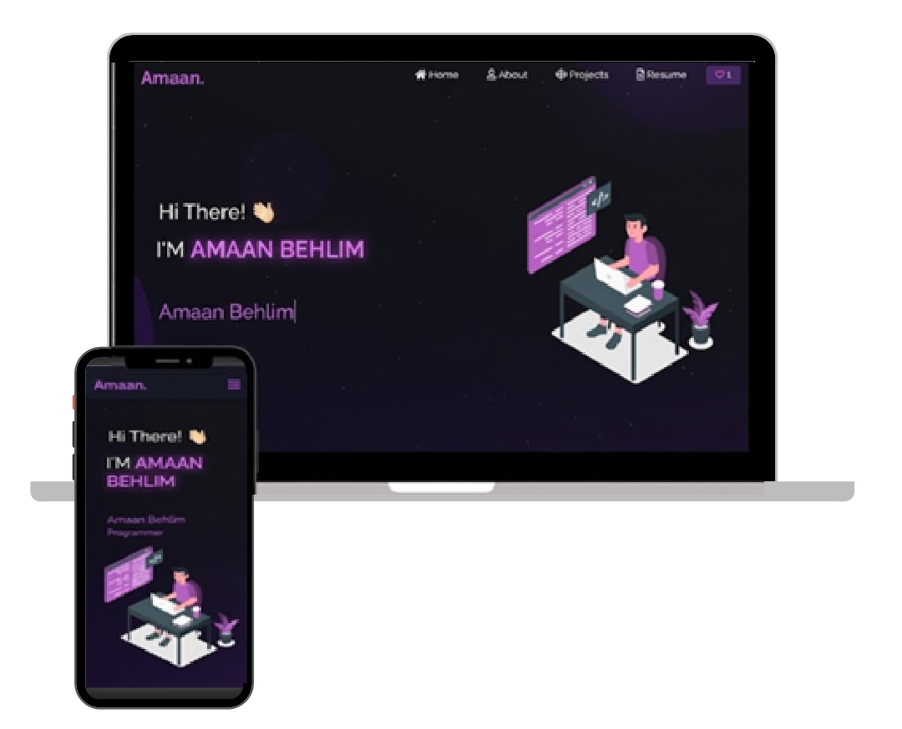

<h2 align="center">
  AI/ML Portfolio Website<br/>
  <a href="https://amaanbehlim-portfolio.vercel.app/" target="_blank">Amaan Behlim</a>
</h2>

<div align="center">
  
</div>

<br/>

<div align="center">

[](https://react.dev/)
[](https://developer.mozilla.org/)
[]()
[]()
[]()

</div>

---

# 🚀 About

Welcome to my personal portfolio website!

I'm **Amaan Behlim**, an **AI/ML Engineer** passionate about building intelligent applications using **Machine Learning, Deep Learning, Generative AI, LLMs, and RAG**.

This portfolio showcases my projects, technical skills, work experience, certifications, and resume in a clean, responsive, and modern interface.

---

# 🌐 Live Demo

🔗 **Portfolio:** https://amaanbehlim-portfolio.vercel.app/

---

# 💡 Featured Projects

- 🤖 AI Video Agent
- 🎬 Movie Recommendation System
- 🩺 Diabetes Prediction System
- 🔥 Forest Fire Prediction System
- 🎓 Smart Attendance System
- ✍️ Next Word Predictor

---

# 🛠 Tech Stack

### Programming

- Python
- SQL
- JavaScript

### AI & Machine Learning

- Machine Learning
- Deep Learning
- CNN
- ANN
- RNN
- LSTM
- NLP
- Generative AI
- LLMs
- RAG
- FAISS
- Hugging Face
- LangChain
- TensorFlow
- Scikit-learn
- XGBoost

### Data Science

- NumPy
- Pandas
- Matplotlib
- Seaborn
- Power BI

### Cloud & Tools

- AWS
- Microsoft Azure
- Docker
- Git
- GitHub
- Streamlit
- Jupyter Notebook
- VS Code

---

# ✨ Features

- 🎨 Modern Glassmorphism UI
- 🌙 Dark Theme
- ⚡ Smooth Animations
- 📱 Fully Responsive
- 🧠 AI/ML Focused Design
- 💼 Resume Section
- 📂 Project Showcase
- 🛠 Skills & Tools
- 📬 Contact Information

---

# ⚙ Installation

Clone the repository

```bash
git clone https://github.com/BehlimAmaan/Portfolio.git
```

Move into the project

```bash
cd Portfolio
```

Install dependencies

```bash
npm install
```

Run locally

```bash
npm start
```

or

```bash
npm run dev
```

---

# 📂 Project Structure

```
src
│
├── Assets
├── Components
├── Pages
├── Images
├── App.js
└── index.js
```

---

# 📬 Connect With Me

📧 **Email:** itzamaanbehlim45@gmail.com

💼 **LinkedIn:**  
https://linkedin.com/in/amaanbehlim

💻 **GitHub:**  
https://github.com/BehlimAmaan

---

# ⭐ Support

If you like this portfolio, consider giving the repository a **⭐ Star**.

It helps support my work and motivates me to build more AI-powered projects.

---

<h3 align="center">
Made with ❤️ by <b>Amaan Behlim</b>
</h3>